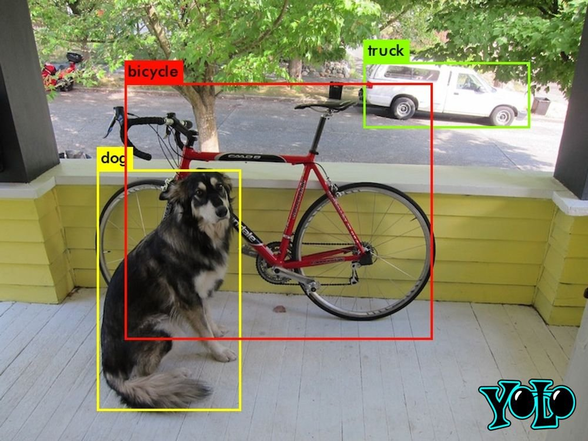

# 🎯 Projeto YOLO — Detecção de Objetos com Transfer Learning



> Projeto de criação de base de dados customizada e treinamento da rede YOLO para detecção de objetos em tempo real.

---

## 📋 Descrição

Este projeto implementa um pipeline completo de **detecção de objetos** utilizando a arquitetura **YOLOv5/YOLOv8**, incluindo:

- Rotulagem de imagens com **LabelMe**
- Conversão de anotações para o formato YOLO
- **Transfer Learning** a partir de pesos pré-treinados no COCO
- Treinamento com **pelo menos 2 classes customizadas**
- Avaliação e inferência com visualização dos resultados

---

## 🗂️ Estrutura do Projeto

```
yolo-project/
├── dataset/
│   ├── images/
│   │   ├── train/          # Imagens de treino
│   │   ├── val/            # Imagens de validação
│   │   └── test/           # Imagens de teste
│   ├── labels/
│   │   ├── train/          # Anotações .txt (formato YOLO)
│   │   ├── val/
│   │   └── test/
│   └── data.yaml           # Configuração das classes
├── configs/
│   └── yolov5_custom.yaml  # Configuração do modelo
├── scripts/
│   ├── labelme2yolo.py     # Conversão LabelMe → YOLO
│   ├── split_dataset.py    # Divisão treino/val/teste
│   ├── train.py            # Script de treinamento
│   └── detect.py           # Script de inferência
├── notebooks/
│   └── train_colab.ipynb   # Notebook para Google Colab
├── results/                # Resultados e métricas
├── requirements.txt
└── README.md
```

---

## 🚀 Como Usar

### 1. Clone o repositório

```bash
git clone https://github.com/SEU_USUARIO/yolo-project.git
cd yolo-project
```

### 2. Instale as dependências

```bash
pip install -r requirements.txt
```

### 3. Rotule suas imagens com LabelMe

```bash
labelme dataset/images/train/
```

> 💡 **Alternativa**: Use as imagens já rotuladas do [COCO Dataset](https://cocodataset.org/#home)

### 4. Converta as anotações para o formato YOLO

```bash
python scripts/labelme2yolo.py \
  --input dataset/images/train/ \
  --output dataset/labels/train/ \
  --classes sua_classe1 sua_classe2
```

### 5. Divida o dataset

```bash
python scripts/split_dataset.py \
  --images_dir dataset/images/all/ \
  --train_ratio 0.7 --val_ratio 0.2 --test_ratio 0.1
```

### 6. Treine o modelo

**Localmente:**
```bash
python scripts/train.py \
  --data dataset/data.yaml \
  --epochs 100 \
  --batch-size 16 \
  --img 640 \
  --weights yolov5s.pt
```

**No Google Colab:**

[](https://colab.research.google.com/drive/1lTGZsfMaGUpBG4inDIQwIJVW476ibXk_)

### 7. Rode a inferência

```bash
python scripts/detect.py \
  --weights results/best.pt \
  --source dataset/images/test/ \
  --conf 0.4
```

---

## 🏷️ Classes do Projeto

| ID | Classe | Descrição |
|----|--------|-----------|
| 0  | classe_1 | Primeira classe customizada |
| 1  | classe_2 | Segunda classe customizada |

> ⚠️ Atualize as classes no arquivo `dataset/data.yaml` conforme seu projeto.

---

## 📊 Resultados

| Métrica | Valor |
|---------|-------|
| mAP@0.5 | — |
| Precisão | — |
| Recall   | — |
| FPS      | — |

*Preencha após o treinamento.*

---

## 🛠️ Ferramentas Utilizadas

| Ferramenta | Link | Uso |
|------------|------|-----|
| YOLOv5/v8 | [Ultralytics](https://github.com/ultralytics/yolov5) | Modelo de detecção |
| LabelMe | [labelme.csail.mit.edu](http://labelme.csail.mit.edu/Release3.0/) | Rotulagem de imagens |
| COCO Dataset | [cocodataset.org](https://cocodataset.org/#home) | Base de dados pré-rotulada |
| Google Colab | [Colab Notebook](https://colab.research.google.com/drive/1lTGZsfMaGUpBG4inDIQwIJVW476ibXk_) | Treinamento em GPU |
| Darknet | [pjreddie.com](https://pjreddie.com/darknet/yolo/) | Framework YOLO original |

---

## 📚 Referências

- Redmon, J. et al. *You Only Look Once: Unified, Real-Time Object Detection*. CVPR, 2016.
- [Ultralytics YOLOv5 Docs](https://docs.ultralytics.com/)
- [COCO Dataset Paper](https://arxiv.org/abs/1405.0312)

---

## 👨‍💻 Autor

Projeto desenvolvido como atividade prática do curso de Visão Computacional.
